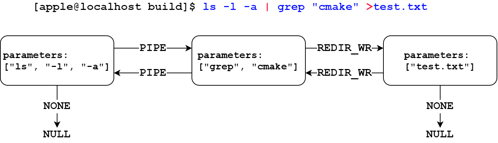

# MySHell
This README file helps you understand how `msh` works.

## Framework
The framework of code and workflow of `msh` are shown in the figures below.
<div align="center">
  
</div>

<div align="center">
  
</div>

## Implementation
In a shell, the commands are sperated to built-in commands and external commands.
Built-in commands are the commands like
```bash
$ cd 
$ help
$ exit
```
and be executed in shell process directly.
In the otehr hand, the external commands will execute the program out of shell,
which can be implemented by `exec` functions in C.
However, after calling `exec` and exiting the executed program, the original process exits as well.
Therefore, the external commands should be executed in a child process. We can use `fork` to create a child process, and we call `exec` in this process and the main process waiting it to exit.

### TODO

Parsing the input command.
<div align="center">
  
</div>

Run a command with pipe and redirection: executing sub-commands recursively.
<div align="center">
  
</div>

